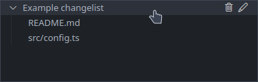

# Git changelists manager

Inspired by [this vscode extension](https://github.com/koenigstag/git-changelists), which I used for a short time before it stopped working.

This extension mainly uses the `git update-index --assume-unchanged <filepath>` and `git update-index --no-assume-unchanged <filepath>` commands to **locally** ignore files from git without using the `.gitignore` file.

It also allows the user to group files into changelists so that they can be restored all at once later.

## Release Notes
### 1.0.0
- Initial release

### 1.0.1
- Extension icon

### 1.0.2
- Handling multi-file operations
- New options in the right-click context menu
- Show file icon in changelist view
- Removed all extension commands from the command palette (they didn't do anything)